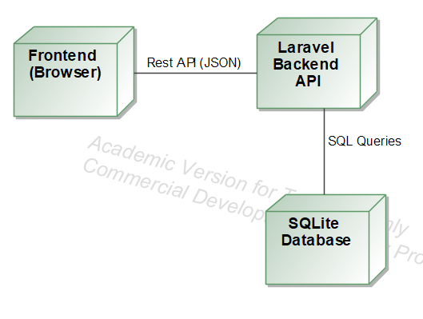

# Knygų rekomendacijų sistema

## 1. Sprendžiamo uždavinio aprašymas

### 1.1 Sistemos paskirtis
Knygų rekomendacijų sistema skirta naudotojams peržiūrėti knygas, pateikti jų rekomendacijas ir vertinimus, o administratoriams – valdyti sistemos turinį. Sistema realizuota kaip REST principais pagrįsta informacinė sistema su atskirta naudotojo sąsaja.

Sistema leidžia efektyviai valdyti knygų katalogą, rekomendacijų turinį ir naudotojų prieigos teises.

## 2. Funkciniai reikalavimai

### 2.1 Bendri naudotojai
- Peržiūrėti knygų kategorijas
- Peržiūrėti knygų sąrašą
- Peržiūrėti knygų rekomendacijas
- Registruotis ir prisijungti prie sistemos

### 2.2 Autentifikuoti naudotojai
- Kurti, redaguoti ir šalinti savo knygas
- Kurti, redaguoti ir šalinti savo rekomendacijas
- Gauti savo naudotojo informaciją
- Atsijungti nuo sistemos

### 2.3 Administratorius
- Kurti, redaguoti ir šalinti kategorijas
- Tvirtinti naudotojų registracijas
- Tvirtinti rekomendacijas
- Šalinti bet kurias knygas ir rekomendacijas

## 3. Sistemos architektūra
Sistema sukurta naudojant kliento–serverio architektūrą.

### 3.1 Architektūros komponentai
- Kliento pusė: HTML, CSS, JavaScript
- Serverio pusė: Laravel REST API
- Duomenų bazė: MySQL
- Autentifikacija: JWT (JSON Web Token)

### 3.2 UML Deployment diagrama
Sistemos diegimo diagrama sudaryta naudojant „Magic Systems Draw“ įrankį. Diagrama apima naudotojo naršyklę, programų serverį (Laravel) ir duomenų bazės serverį (MySQL).

## 4. Naudotojo sąsajos projektas

### 4.1 Wireframe projektavimas
Suprojektuoti šių sąsajos langų wireframe’ai:
- Pagrindinis puslapis
- Knygų sąrašas
- Rekomendacijų puslapis
- Prisijungimo ir registracijos forma
- Naudotojo profilis

### 4.2 Naudotojo sąsajos realizacija
- Responsive dizainas su lūžio tašku ties 768px
- Prisitaikantys paveikslėliai (max-width: 100%)
- Skirtingas Header, Content ir Footer stilius
- Responsive meniu su hamburger navigacija
- Modaliniai informaciniai langai
- CSS animacijos ir perėjimai
- Vektorinės ikonos (Feather Icons)
- Google Fonts šriftai
- Tinkleliu pagrįstas išdėstymas

## 5. API specifikacija
API aprašyta naudojant OpenAPI 3.1 standartą.

Specifikacijos failas: `api-spec.yaml`

### 5.1 Pagrindinės API grupės
- Auth – autentifikacija ir autorizacija
- Categories – kategorijų valdymas
- Books – knygų valdymas
- Recommendations – rekomendacijų valdymas
- Users – naudotojų administravimas

Kiekvienam API metodui pateikti galimi atsako kodai, užklausų ir atsakymų pavyzdžiai bei autorizacijos reikalavimai.

## 6. Projekto išvados
Projekte sukurta pilnai veikianti knygų rekomendacijų sistema, atitinkanti REST architektūros principus. Sistema pasižymi aiškia struktūra, saugia autentifikacija ir patogia naudotojo sąsaja. OpenAPI specifikacija užtikrina sistemos plečiamumą ir testuojamumą.

## 7. Naudotos technologijos
- Laravel
- PHP
- MySQL
- HTML5
- CSS3
- JavaScript
- JWT
- OpenAPI 3.1
- Magic Systems Draw

## 8. Projekto struktūra
├── app/
├── routes/
├── resources/
│ └── views/
├── public/
├── api-spec.yaml
└── docs/
  └── deployment-diagram.png

## 9. Atitiktis reikalavimams
- REST API realizuotas
- Naudotojo sąsaja responsyvi
- Pateikta OpenAPI specifikacija
- Parengta UML diagrama
- Paruošta pilna projekto dokumentacija
